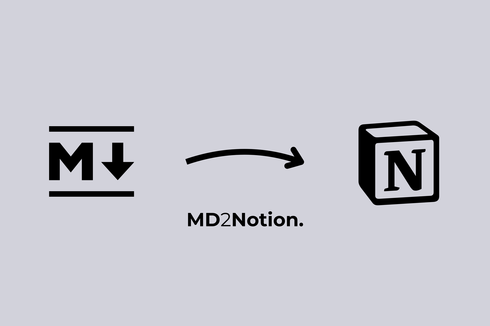

<p align="center">
    
</p>
<p align="center"><h1 align="center">MD2NOTION</h1></p>
<p align="center">
	<em>Transform Markdown into Notion Magic!</em>
</p>
<p align="center">
	
	
	
	
</p>
<p align="center"><!-- default option, no dependency badges. -->
</p>
<p align="center">
	<!-- default option, no dependency badges. -->
</p>
<br>

## Table of Contents

- [ Overview](#-overview)
- [ Features](#-features)
- [ Project Structure](#-project-structure)
  - [ Project Index](#-project-index)
- [ Getting Started](#-getting-started)
  - [ Prerequisites](#-prerequisites)
  - [ Installation](#-installation)
  - [ Usage](#-usage)
  <!-- - [ Testing](#-testing) -->
- [ Project Roadmap](#-project-roadmap)
- [ Contributing](#-contributing)
- [ License](#-license)
- [ Acknowledgments](#-acknowledgments)

---

## Overview

MD2Notion is a lightweight yet powerful tool designed to streamline the integration of Markdown content, including GPT-generated outputs, into Notion. It ensures seamless compatibility with the Notion API, enhancing workflow efficiency and enabling the creation of well-structured, organized, and accessible Notion pages.

---

## Features

|     |      Feature      | Summary                                                                                                                                                                                                                                                                                                |
| :-- | :---------------: | :----------------------------------------------------------------------------------------------------------------------------------------------------------------------------------------------------------------------------------------------------------------------------------------------------- |
| ⚙️  | **Architecture**  | <ul><li>Built primarily in `<Python>` for ease of use and integration.</li><li>Utilizes a modular design to facilitate the conversion of Markdown to Notion-compatible formats.</li><li>Structured to allow seamless integration with the Notion API for enhanced content management.</li></ul>        |
| 🔩  | **Code Quality**  | <ul><li>Follows best practices in Python coding standards.</li><li>Includes a `setup.py` file for packaging and distribution, ensuring a clean installation process.</li><li>Code is organized into distinct modules for clarity and maintainability.</li></ul>                                        |
| 📄  | **Documentation** | <ul><li>Documentation is embedded within the code, particularly in the `setup.py` and main script files.</li><li>Describes the functionality of the tool and its integration with Notion.</li><li>Clear instructions on how to utilize the tool for converting Markdown documents.</li></ul>           |
| 🔌  | **Integrations**  | <ul><li>Directly integrates with the `<Notion API>` for content management.</li><li>Facilitates the transformation of Markdown documents into a format that Notion can understand.</li><li>Enhances user workflows by bridging Markdown and Notion functionalities.</li></ul>                          |
| 🧩  |  **Modularity**   | <ul><li>Modular design allows for easy updates and maintenance of individual components.</li><li>Each module handles specific tasks, such as parsing Markdown and interfacing with the Notion API.</li><li>Encourages reusability of code across different projects.</li></ul>                         |
| ⚡️ |  **Performance**  | <ul><li>Optimized for quick parsing and conversion of Markdown documents.</li><li>Efficient handling of various Markdown elements to minimize processing time.</li><li>Designed to work seamlessly with the Notion API, ensuring fast content uploads.</li></ul>                                       |
| 🛡️  |   **Security**    | <ul><li>Utilizes secure methods for API interactions to protect user data.</li><li>Follows best practices for handling sensitive information, especially when interfacing with external APIs.</li><li>Encourages the use of environment variables for API keys and sensitive configurations.</li></ul> |
| 📦  | **Dependencies**  | <ul><li>Primarily depends on `<Python>` for execution.</li><li>No additional package managers or containers are specified, simplifying the setup process.</li><li>Minimal dependencies enhance portability and ease of installation.</li></ul>                                                         |

---

## Project Structure

```sh
└── MD2Notion/
    ├── LICENSE
    ├── README.md
    ├── md2notion
    │   ├── __init__.py
    │   └── md2notion.py
    └── setup.py
```

### Project Index

<details open>
	<summary><b><code>MD2NOTION/</code></b></summary>
	<details> <!-- __root__ Submodule -->
		<summary><b>__root__</b></summary>
		<blockquote>
			<table>
			<tr>
				<td><b><a href='https://github.com/oshalash38/MD2Notion/blob/master/setup.py'>setup.py</a></b></td>
				<td>- Facilitates the packaging and distribution of the md2notion utility, which serves to convert Markdown documents into Notion-compatible formats<br>- By defining essential metadata such as the project name and version, it ensures seamless integration within the broader codebase architecture, enabling users to easily install and utilize the tool for enhancing their workflow with Markdown and Notion.</td>
			</tr>
			</table>
		</blockquote>
	</details>
	<details> <!-- md2notion Submodule -->
		<summary><b>md2notion</b></summary>
		<blockquote>
			<table>
			<tr>
				<td><b><a href='https://github.com/oshalash38/MD2Notion/blob/master/md2notion/md2notion.py'>md2notion.py</a></b></td>
				<td>- MD2Notion serves to transform markdown-like text into a structured format compatible with the Notion API<br>- By parsing various text elements such as headings, bulleted lists, and bold formatting, it generates a hierarchical representation of content<br>- This functionality enhances the integration of markdown documents into Notion, facilitating seamless content management and organization within the platform.</td>
			</tr>
			</table>
		</blockquote>
	</details>
</details>

---

## Getting Started

### Prerequisites

Before getting started with MD2Notion, ensure your runtime environment meets the following requirements:

- **Programming Language:** Python

### Installation

Install MD2Notion using one of the following methods:

**Install using pip (recommended):**

```sh
❯ pip install git+https://github.com/oshalash38/md2notion.git
```

**Build from source:**

1. Clone the MD2Notion repository:

```sh
❯ git clone https://github.com/oshalash38/MD2Notion
```

2. Navigate to the project directory:

```sh
❯ cd MD2Notion
```

3. Build the repository

```sh
❯ python setup.py sdist bdist_wheel
```

<!-- 3. Install the project dependencies:

echo 'INSERT-INSTALL-COMMAND-HERE' -->

### Usage

To use the module, you can import it into your project and use it as follows:

```python
from md2notion.md2notion import MD2Notion

md_content = "### This is a heading!"
md_parser = MD2Notion()
notion_children_blocks = md_parser.parse(md_content)
```

<!-- ### Testing

Run the test suite using the following command:
echo 'INSERT-TEST-COMMAND-HERE'

--- -->

<!-- ## Project Roadmap

- [x] **`Task 1`**: <strike>Implement feature one.</strike>
- [ ] **`Task 2`**: Implement feature two.
- [ ] **`Task 3`**: Implement feature three. -->

---

## Contributing

- **💬 [Join the Discussions](https://github.com/oshalash38/MD2Notion/discussions)**: Share your insights, provide feedback, or ask questions.
- **🐛 [Report Issues](https://github.com/oshalash38/MD2Notion/issues)**: Submit bugs found or log feature requests for the `MD2Notion` project.
- **💡 [Submit Pull Requests](https://github.com/oshalash38/MD2Notion/blob/main/CONTRIBUTING.md)**: Review open PRs, and submit your own PRs.

<details closed>
<summary>Contributing Guidelines</summary>

1. **Fork the Repository**: Start by forking the project repository to your github account.
2. **Clone Locally**: Clone the forked repository to your local machine using a git client.
   ```sh
   git clone https://github.com/oshalash38/MD2Notion
   ```
3. **Create a New Branch**: Always work on a new branch, giving it a descriptive name.
   ```sh
   git checkout -b new-feature-x
   ```
4. **Make Your Changes**: Develop and test your changes locally.
5. **Commit Your Changes**: Commit with a clear message describing your updates.
   ```sh
   git commit -m 'Implemented new feature x.'
   ```
6. **Push to github**: Push the changes to your forked repository.
   ```sh
   git push origin new-feature-x
   ```
7. **Submit a Pull Request**: Create a PR against the original project repository. Clearly describe the changes and their motivations.
8. **Review**: Once your PR is reviewed and approved, it will be merged into the main branch. Congratulations on your contribution!
</details>

<details closed>
<summary>Contributor Graph</summary>
<br>
<p align="left">
   <a href="https://github.com{/oshalash38/MD2Notion/}graphs/contributors">
      
   </a>
</p>
</details>

---

## License

This project is protected under the GPL-3.0 license License. For more details, refer to the [LICENSE](https://choosealicense.com/licenses/) file.

---

## Acknowledgments

- README generated by https://github.com/eli64s/readme-ai

---
